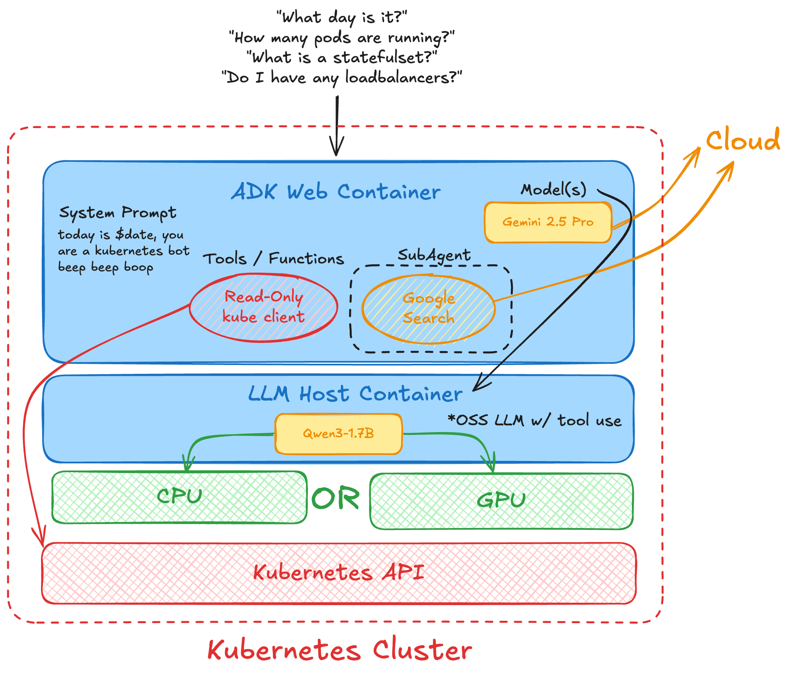
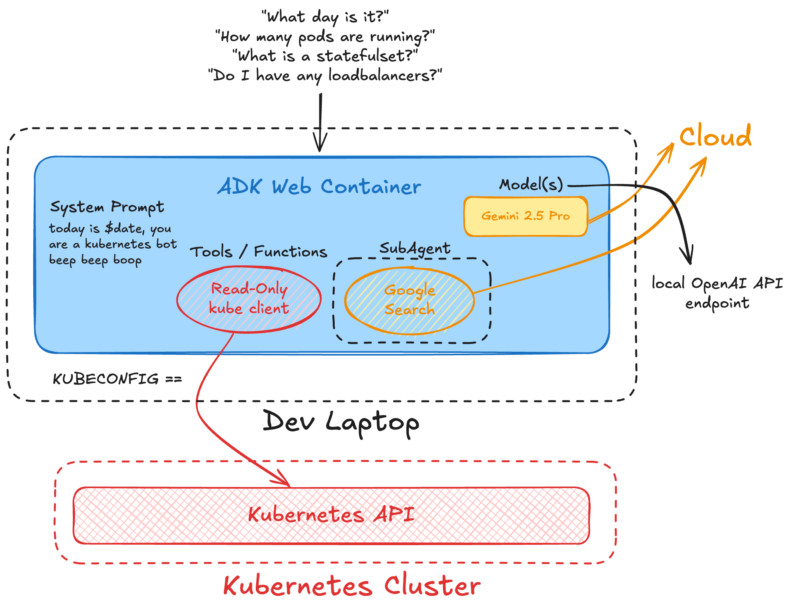

# Kubernetes ADK Agent

Google ADK agent for Kubernetes cluster interaction. Supports cloud (Google Gemini) and local (OpenAI-compatible) LLMs.



## Features

- **LLM Support**: Google Gemini (cloud) or OpenAI-compatible endpoints (local)
- **Authentication**: Kubeconfig file or in-cluster service account
- **Kubernetes Tools**: List/describe pods, nodes, namespaces, services, deployments, and retrieve logs
- **Web Interface**: Built-in ADK web UI for testing

## Prerequisites

- Kubernetes cluster access
- Valid kubeconfig or in-cluster permissions
- **Cloud LLM**: Google AI Studio API key
- **Local LLM**: OpenAI-compatible endpoint (LM Studio, Ollama, etc.)

## Quick Start

### Option 1: Local Testing (Docker)

Pre-built image: `ghcr.io/jimangel/adk-local-gemma:latest`



```bash
# Run with mounted kubeconfig
export KUBECONFIG="your-kubeconfig"
export GOOGLE_API_KEY="your-api-key"

docker run -d \
  --name adk-local-test \
  -p 8082:8081 \
  -v ${KUBECONFIG}:/home/appuser/kubeconfig:ro \
  -e KUBECONFIG=/home/appuser/kubeconfig \
  -e GOOGLE_API_KEY=${GOOGLE_API_KEY} \
  -e LLM_TYPE="cloud" \
  -e GEMINI_MODEL="gemini-2.5-pro" \
  -e GOOGLE_GENAI_USE_VERTEXAI="FALSE" \
  ghcr.io/jimangel/adk-local-gemma:latest
```

Access UI: http://localhost:8082

**Clean up:**
```bash
docker stop adk-local-test && docker rm adk-local-test
```

### Option 2: Kubernetes Deployment

The `k8s-deployment.yaml` includes:
- ServiceAccount with read-only cluster permissions
- ClusterRole and ClusterRoleBinding
- Deployment configuration

**Deploy:**
```bash
# 1. Create API key secret
kubectl create secret generic adk-secrets \
  --from-literal=GOOGLE_API_KEY="your-api-key"

# 2. Apply manifest
kubectl apply -f k8s-deployment.yaml

# 3. Verify deployment
kubectl get pods -l app=adk-local-gemma
kubectl get svc adk-local-gemma
```

**Access service:**
```bash
# Option A: Port forward
kubectl port-forward svc/adk-local-gemma 8081:8081

# Option B: LoadBalancer (if available)
kubectl get svc adk-local-gemma \
  -o jsonpath='{.status.loadBalancer.ingress[0].ip}'
```

**Clean up:**
```bash
kubectl delete -f k8s-deployment.yaml
kubectl delete secret adk-secrets
```

## Configuration

Modify environment variables in `k8s-deployment.yaml`:

```yaml
env:
- name: LLM_TYPE
  value: "cloud"  # or "local"
- name: GEMINI_MODEL
  value: "gemini-2.5-pro"
- name: LOCAL_LLM_URL
  value: "http://localhost:1234/v1"  # for local LLMs
```

## Environment Variables

| Variable | Description | Default |
|----------|-------------|---------|
| `LLM_TYPE` | `cloud` or `local` | `cloud` |
| `GOOGLE_API_KEY` | Google AI Studio API key | Required for cloud |
| `GEMINI_MODEL` | Gemini model name | `gemini-2.5-pro` |
| `LOCAL_LLM_URL` | OpenAI-compatible endpoint | `http://localhost:1234/v1` |
| `KUBECONFIG` | Path to kubeconfig file | In-cluster config |
| `GOOGLE_GENAI_USE_VERTEXAI` | Use Vertex AI | `FALSE` |
