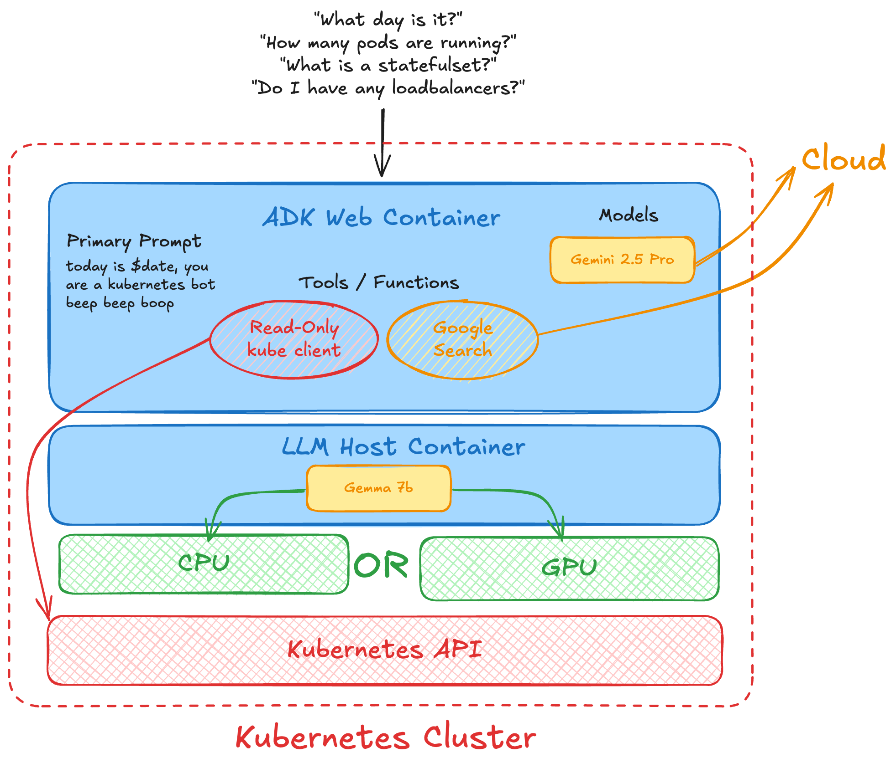

# Kubernetes Local/Cloud ADK Demo



A Google ADK agent that can interact with Kubernetes clusters to retrieve information about pods, nodes, services, deployments, and other resources. Supports both cloud LLMs (Google Gemini) and local LLMs (LM Studio).

## Features

- **Flexible LLM Support**: Use either Google Gemini (cloud) or LM Studio (local) models
- **Flexible Authentication**: Supports both kubeconfig file and in-cluster service account authentication
- **Comprehensive Resource Queries**: List and describe pods, nodes, namespaces, services, and deployments
- **Log Retrieval**: Get pod logs with filtering options
- **Local Testing**: Test locally with `adk web` interface
- **Detailed Information**: Get comprehensive details about Kubernetes resources

## Project Structure

```
kubernetes_agent/
    __init__.py       # Module initialization
    agent.py          # Main agent implementation
    .env              # Environment configuration
    requirements.txt  # Python dependencies
    test_config.py    # Configuration test script
    README.md         # This file
```

## Setup Instructions

### 1. Create Virtual Environment

```bash
# Create virtual environment
python -m venv .venv

# Activate virtual environment
# macOS/Linux:
source .venv/bin/activate
# Windows:
.venv\Scripts\activate.bat
```

### 2. Install Dependencies

```bash
pip install -r requirements.txt
```

### 3. Configure Environment

Edit the `.env` file with your configuration:

#### Option A: Cloud LLM (Google Gemini) - Default

```bash
# Choose LLM type
LLM_TYPE=cloud

# Google AI Studio API Key
GOOGLE_GENAI_USE_VERTEXAI=FALSE
GOOGLE_API_KEY=your_actual_api_key_here

# Gemini model (default: gemini-2.0-pro-exp)
GEMINI_MODEL=gemini-2.0-pro-exp

# Kubernetes Configuration
KUBECONFIG=${HOME}/kubespray/inventory/onemachine/artifacts/admin.conf
```

Get your Gemini API key from [Google AI Studio](https://aistudio.google.com/).

#### Option B: Local LLM (LM Studio)

1. Download and install [LM Studio](https://lmstudio.ai/)
2. Load a model in LM Studio (e.g., Qwen, Llama, Mistral)
3. Enable the server in LM Studio (Developer tab → Enable Server)
4. Configure `.env`:

```bash
# Choose LLM type
LLM_TYPE=local

# LM Studio settings
LM_STUDIO_API_BASE=http://127.0.0.1:1234/v1/
LM_STUDIO_MODEL=lm_studio/qwen3-1.7b

# Kubernetes Configuration
KUBECONFIG=${HOME}/kubespray/inventory/onemachine/artifacts/admin.conf
```

### 4. Test Your Configuration

Run the test script to verify everything is configured correctly:

```bash
python test_config.py
```

This will check:
- LLM configuration (Cloud or Local)
- Kubernetes connectivity
- ADK package installation

### 5. Verify Kubernetes Access

Before running the agent, verify your kubeconfig works:

```bash
export KUBECONFIG=${HOME}/kubespray/inventory/onemachine/artifacts/admin.conf
kubectl get nodes
kubectl get pods --all-namespaces
```

## Running the Agent

### Using ADK Web Interface (Recommended for Testing)

Navigate to the parent directory of your agent project and run:

```bash
adk web
```

This will launch a browser-based interface where you can interact with the agent.

### Using Terminal

```bash
adk run
```

### Using API Server

```bash
adk api_server
```

## LLM Configuration Options

### Cloud Models (Gemini)

When using `LLM_TYPE=cloud`, you can choose from these Gemini models:

- `gemini-2.0-pro-exp` (Default) - Most capable, best for complex queries
- `gemini-2.0-flash-exp` - Faster, good for simpler queries
- `gemini-1.5-pro` - Previous generation pro model
- `gemini-1.5-flash` - Previous generation fast model

### Local Models (LM Studio)

When using `LLM_TYPE=local`, you can use any model loaded in LM Studio:

Popular options:
- **Qwen** models (e.g., `qwen3-1.7b`, `qwen2.5-7b`)
- **Llama** models (e.g., `llama-3.2-3b`, `llama-3.1-8b`)
- **Mistral** models (e.g., `mistral-7b`)
- **Phi** models (e.g., `phi-3-mini`)

To switch models:
1. Load the desired model in LM Studio
2. Update `LM_STUDIO_MODEL` in `.env`
3. Restart the ADK agent

### Choosing Between Cloud and Local

**Use Cloud (Gemini) when:**
- You need the most capable model
- You want minimal setup
- You have a stable internet connection
- You're okay with API costs

**Use Local (LM Studio) when:**
- You want to run completely offline
- You have privacy/security concerns
- You want zero API costs
- You're testing/developing frequently

### Quick Switching Between LLMs

To quickly switch between cloud and local LLMs without editing `.env`:

```bash
# Use local LLM temporarily
export LLM_TYPE=local
adk web

# Use cloud LLM temporarily
export LLM_TYPE=cloud
adk web
```

Or create shell aliases for convenience:

```bash
# Add to ~/.bashrc or ~/.zshrc
alias adk-local='LLM_TYPE=local adk web'
alias adk-cloud='LLM_TYPE=cloud adk web'
```

## Available Tools/Functions

### 1. `get_pods(namespace="all", label_selector=None)`
Lists pods in the cluster.
- **namespace**: Specify namespace or "all" for all namespaces
- **label_selector**: Optional label selector (e.g., "app=nginx")

### 2. `get_nodes()`
Lists all nodes in the cluster with their status and resources.

### 3. `get_namespaces()`
Lists all namespaces in the cluster.

### 4. `get_services(namespace="all")`
Lists services in the cluster.
- **namespace**: Specify namespace or "all" for all namespaces

### 5. `get_deployments(namespace="all")`
Lists deployments in the cluster.
- **namespace**: Specify namespace or "all" for all namespaces

### 6. `describe_pod(name, namespace="default")`
Gets detailed information about a specific pod.
- **name**: Pod name
- **namespace**: Pod namespace

### 7. `get_logs(pod_name, namespace="default", container=None, previous=False, tail_lines=None, since_seconds=None, timestamps=False)`
Retrieves logs from a pod container.
- **pod_name**: Name of the pod
- **namespace**: Namespace of the pod
- **container**: Container name (required if pod has multiple containers)
- **previous**: Get logs from previous terminated container
- **tail_lines**: Number of lines from the end (e.g., 100)
- **since_seconds**: Get logs from last N seconds (e.g., 3600 for last hour)
- **timestamps**: Include timestamps in output

## Example Queries to Try

Once the agent is running, try these queries:

1. **Basic Queries:**
   - "Show me all pods in the cluster"
   - "List all nodes and their status"
   - "What namespaces exist?"

2. **Filtered Queries:**
   - "Show me pods in the default namespace"
   - "List services in the kube-system namespace"
   - "Show me all deployments"

3. **Detailed Queries:**
   - "Describe the pod named nginx-deployment-xxx in default namespace"
   - "How many pods are running on each node?"
   - "Which pods are not in Running state?"

4. **Log Queries:**
   - "Show me the logs for pod nginx-xxx"
   - "Get the last 50 lines of logs from pod my-app in namespace production"
   - "Show me logs from the last hour for pod backend-api"
   - "Get previous container logs for crashed pod my-pod"
   - "Show logs with timestamps for debugging pod worker-123"

## Authentication Methods

The agent supports multiple authentication methods in order of preference:

1. **Explicit kubeconfig path**: Passed directly to functions
2. **KUBECONFIG environment variable**: Set in `.env` or shell
3. **In-cluster config**: For running inside a Kubernetes pod
4. **Default location**: `~/.kube/config`

## Troubleshooting

### LM Studio Connection Issues

If you're using local LLM and encounter connection errors:

1. Verify LM Studio server is running:
   - Open LM Studio → Developer tab → Enable "Server"
   - Check the server URL matches your `.env` setting

2. Test the connection:
   ```bash
   curl http://127.0.0.1:1234/v1/models
   ```

3. Check the model is loaded:
   - In LM Studio, ensure a model is selected and loaded
   - The model name in `.env` should match

### Connection Issues

If you encounter connection issues:

1. Verify your kubeconfig is valid:
   ```bash
   kubectl cluster-info
   ```

2. Check the KUBECONFIG environment variable:
   ```bash
   echo $KUBECONFIG
   ```

3. Ensure the cluster is accessible:
   ```bash
   kubectl get nodes
   ```

### Permission Issues

If you get permission errors, ensure your kubeconfig has the necessary RBAC permissions:
```bash
kubectl auth can-i list pods --all-namespaces
kubectl auth can-i list nodes
```

### SSL/Certificate Issues

If you encounter SSL verification issues with self-signed certificates, you may need to configure the kubernetes client to skip verification (not recommended for production):

```python
# In agent.py, after loading config:
from kubernetes import client
configuration = client.Configuration.get_default_copy()
configuration.verify_ssl = False
client.Configuration.set_default(configuration)
```

## Best Practices

1. **Security**: Never commit your `.env` file with actual API keys to version control
2. **RBAC**: Use service accounts with minimal required permissions
3. **Error Handling**: The agent includes comprehensive error handling for API failures
4. **Resource Limits**: Be mindful of API rate limits when querying large clusters

## Extending the Agent

To add more Kubernetes functionality:

1. Import additional Kubernetes API clients:
   ```python
   from kubernetes import client
   batch_v1 = client.BatchV1Api()  # For Jobs
   networking_v1 = client.NetworkingV1Api()  # For Ingresses
   ```

2. Create new tool functions following the pattern:
   ```python
   def get_jobs(namespace: str = "all") -> Dict[str, Any]:
       # Implementation
       pass
   ```

3. Add the new tools to the agent:
   ```python
   tools=[..., get_jobs]
   ```

### Example: Adding ConfigMap Support

```python
def get_configmaps(namespace: str = "all") -> Dict[str, Any]:
    try:
        config_status = load_kubernetes_config()
        v1 = client.CoreV1Api()
        
        if namespace.lower() == "all":
            configmaps = v1.list_config_map_for_all_namespaces(watch=False)
        else:
            configmaps = v1.list_namespaced_config_map(namespace=namespace, watch=False)
        
        cm_list = [
            {
                "name": cm.metadata.name,
                "namespace": cm.metadata.namespace,
                "data_keys": list(cm.data.keys()) if cm.data else []
            }
            for cm in configmaps.items
        ]
        
        return {
            "status": "success",
            "configmaps": cm_list
        }
    except Exception as e:
        return {"status": "error", "error_message": str(e)}
```

## Requirements

- Python 3.9+
- Access to a Kubernetes cluster
- Valid kubeconfig or in-cluster permissions
- **For Cloud LLM**: Google AI Studio API key (for Gemini model)
- **For Local LLM**: LM Studio installed with a model loaded

## Dependencies

The agent uses these Python packages:
- `google-adk` - Google Agent Development Kit
- `kubernetes` - Official Kubernetes Python client
- `python-dotenv` - Environment variable management
- `litellm` - Multi-LLM support (for local models)

## Support

For issues related to:
- **ADK**: Check the [Google ADK documentation](https://cloud.google.com/agent-development-kit)
- **Kubernetes Python Client**: See [kubernetes-client/python](https://github.com/kubernetes-client/python)
- **Kubernetes API**: Refer to [Kubernetes API documentation](https://kubernetes.io/docs/reference/)