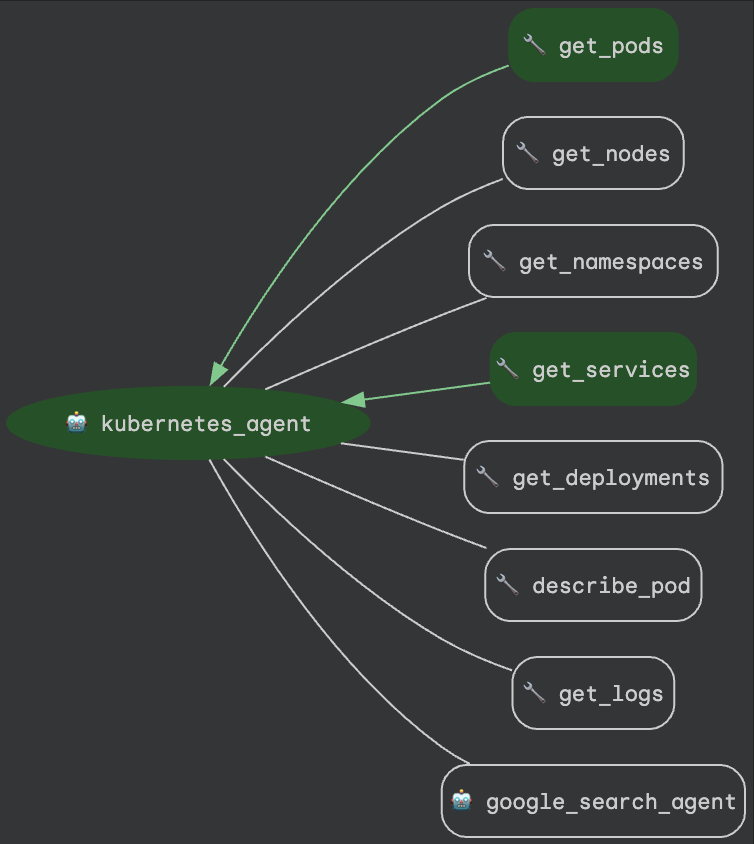

# Kubernetes ADK Agent

Google ADK agent for Kubernetes cluster interaction. Supports cloud (Google Gemini) and local (OpenAI-compatible) LLMs.


ADK Web Container:



## Features

- **LLM Support**: Google Gemini (cloud) or OpenAI-compatible endpoints (local)
- **Authentication**: Kubeconfig file or in-cluster service account
- **Kubernetes Tools**: List/describe pods, nodes, namespaces, services, deployments, and retrieve logs
- **Web Interface**: Built-in ADK web UI for testing

## Prerequisites

- Kubernetes cluster access
- Valid kubeconfig or in-cluster permissions
- **Cloud LLM**: Google AI Studio API key
- **Local LLM**: OpenAI-compatible endpoint (LM Studio, Ollama, etc.)

## The importance of the `LLM_TYPE` variable

The code is written to demonstrate both cloud and local LLM features. To switch between features you can set `cloud` or `local`. By setting:

```bash
LLM_TYPE=cloud
```

The ADK agent leverages the cloud (Gemini) and by setting:

```bash
LLM_TYPE=local
```

The agent leverages local LLM at the endpoint of:

```bash
LM_STUDIO_API_BASE=YOUR_HTTP_URL_V1_API
LM_STUDIO_MODEL=YOUR_MODEL_REF
```

Look at the `.env-sample` for more ideas, most of these variables are set in the `docker run` command or in the kubernetes yaml.

## Quick Start

### Option 1: Local Testing (Docker)

Pre-built image: `ghcr.io/jimangel/adk-local-gemma:latest`


```bash
# select kubeconfig to use
export KUBECONFIG="your-kubeconfig"

# Run using a cloud LLM
export GOOGLE_API_KEY="your-api-key"

docker run \
  --name adk-local-test \
  -p 8082:8081 \
  -v ${KUBECONFIG}:/home/appuser/kubeconfig:ro \
  -e KUBECONFIG=/home/appuser/kubeconfig \
  -e GOOGLE_API_KEY=${GOOGLE_API_KEY} \
  -e LLM_TYPE="cloud" \
  -e GEMINI_MODEL="gemini-2.5-pro" \
  -e GOOGLE_GENAI_USE_VERTEXAI="FALSE" \
  -e LLM_TYPE=cloud \
  ghcr.io/jimangel/adk-local-gemma:latest

# Access UI: http://localhost:8082

# Run using a local LLM (ollama) - or use the host / service name in cluster ollama.svc.xxx

# (optional) run ollama instance
docker run -d --name ollama --platform=linux/arm64/v8 \
  -p 11434:11434 -v ollama:/root/.ollama ollama/ollama:latest

docker exec -it ollama ollama pull qwen3:1.7b

# Run using a local LLM
export LM_STUDIO_API_BASE=http://localhost:11434/v1/
# export LM_STUDIO_API_BASE=http://127.0.0.1:1234/v1/

#export LM_STUDIO_MODEL=qwen/qwen3-1.7b # for LM Studio
export LM_STUDIO_MODEL=qwen3:1.7b # for Ollama

docker run \
  --name adk-local-test \
  --network host \
  -e PORT=8888 \
  -v ${KUBECONFIG}:/home/appuser/kubeconfig:ro \
  -e KUBECONFIG=/home/appuser/kubeconfig \
  -e LLM_TYPE=local \
  -e LM_STUDIO_MODEL=${LM_STUDIO_MODEL} \
  -e LM_STUDIO_API_BASE=${LM_STUDIO_API_BASE} \
  ghcr.io/jimangel/adk-local-gemma:latest

# Access UI: http://localhost:8888
```

**Clean up:**
```bash
docker stop adk-local-test && docker rm adk-local-test
```

### Option 2: Kubernetes Deployment

The `k8s-deployment.yaml` includes:
- ServiceAccount with read-only cluster permissions
- ClusterRole and ClusterRoleBinding
- Deployment configuration


Optionally deploy a local Ollama server:

```bash
cat <<EOF | kubectl apply -f -
apiVersion: apps/v1
kind: Deployment
metadata:
  name: ollama
spec:
  replicas: 1
  selector:
    matchLabels:
      app: ollama
  template:
    metadata:
      labels:
        app: ollama
    spec:
      containers:
        - name: ollama
          image: ollama/ollama:latest
          ports:
            - containerPort: 11434
          volumeMounts:
            - name: ollama-data
              mountPath: /root/.ollama
      volumes:
        - name: ollama-data
          emptyDir: {}
---
apiVersion: v1
kind: Service
metadata:
  name: ollama
spec:
  selector:
    app: ollama
  ports:
    - port: 11434
      targetPort: 11434
      protocol: TCP
  type: ClusterIP
EOF

# wait for it to ready up:
kubectl get pods --watch

# pull a model to use:
kubectl exec -it deploy/ollama -- ollama pull qwen3:1.7b
```

**Deploy:**
```bash
# Clone repo
git clone https://github.com/jimangel/adk-local-gemma.git
cd adk-local-gemma

# (optional, or if using cloud) create API key secret
export GOOGLE_API_KEY="your-api-key"
kubectl create secret generic adk-secrets \
  --from-literal=GOOGLE_API_KEY=${GOOGLE_API_KEY}
```

> **Tweaking / Configuration:** Modify environment variables in `k8s-deployment.yaml` (like model path / etc if needed)

```bash
# Apply manifest (defaults to local)
kubectl apply -f k8s-deployment.yaml
```

**Access service:**
```bash
# Port forward
kubectl port-forward svc/adk-local-gemma 8081:8081
```

**Clean up:**
```bash
kubectl delete -f k8s-deployment.yaml
kubectl delete secret adk-secrets

# debug // check env vars
kubectl exec -it deploy/adk-local-gemma -- sh
```


